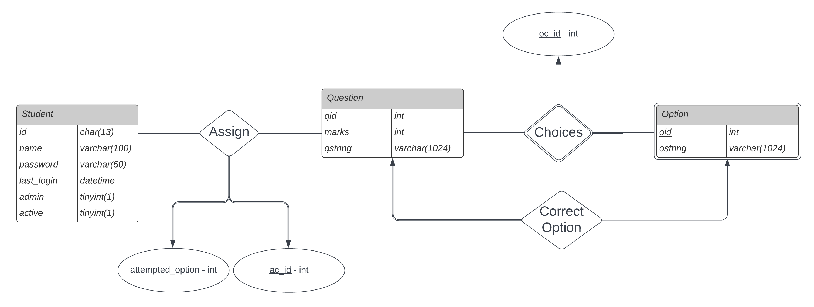

# System modelling

## ER diagram

## Schema design and list of tables required

We have five tables that form our schema:

1. **student** (<u>id</u>, name, password, last_login, admin, active) : The student table contains the details of the student such as name, id and password. The password is hashed for enhanced security. It also has the attributes lost_login, admin and active that are required by django.

2. **question** (<u>qid</u>, marks, qstring) : The question table is the question bank. It contains the qid, the qstring and the marks of the questions. 

3. **option_choices** (<u>oc_id</u>, qid, oid) : The option_choices table is the merged form of the option entity and the choices relation from the ER diagram. Option is a weak entity type that is owned the question entity through the choices owner relation. oc_id is a key that uniquely identifies a given qid oid pair. 

4. **correct_option** (<u>qid</u>, oid) : The correct_option table is a relation that identifies the correct option for a given question. 

5. **assign** (<u>ac_id</u>, id, qid, attempted_option) : The assign relation assignes questions  to a students. It is identified by a primary key ac_id and also contains the option attempted by the student for that question.

## Data normalisation

Here the functional dependencies are:

id -> name, password, last_login, admin, active

qid -> marks, qstring

oc_id -> qid, oid

correct_option.qid -> correct_option.oid

ac_id -> id, qid, attempted_option

Since there are no multi-valued attributes, the schema is in 1 NF

Since there are no composite primary keys, there are no partial dependencies and thus the schema is in 2 NF

Since there are no transitive dependencies, the schema is in 3 NF.

Since, there are no non-trivial dependencies, the schema is in BCNF.

Thus the given database is normalised upto BCNF.

---

## Procedures and Views

### 1.Procedures

We have three sets of procedures for insertion, updation and deletion of data into the tables. All procedures are in the form of transactions to ensure concurrency and **ACID** properties. Some of these procedures are called from django and the test data creation sql file. While the other procedures aren't currently being called, they can be used in future if we wish to extend the functionality of the platform.

#### A. [Insertion Procedures](../database/insertion_procedures.sql):

1. `insert_studentinfo`

2. `insert_questioninfo`

3. `insert_questionoptions`

4. `insert_correctoption`

5. `insert_assign`

#### B. [Updation Procedures](../database/updation_procedures.sql):

1. `update_studentpwd`

2. `update_correctoption`

3. `update_assign`

#### C. [Deletion Procedures](../database/deletion_procedures.sql):

1. `delete_student`

2. `delete_question`

3. `delete_options`

4. `delete_assign`

### 2. [Views](../database/view_creation.sql)

We have a single view **leaderboard** for maintaining the run-time leaderboard for the quiz. When a student reattempts the quiz, their previous attempt is wiped out as the leaderboard is not explicitly being stored in the database.
